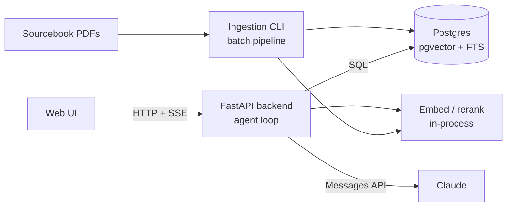
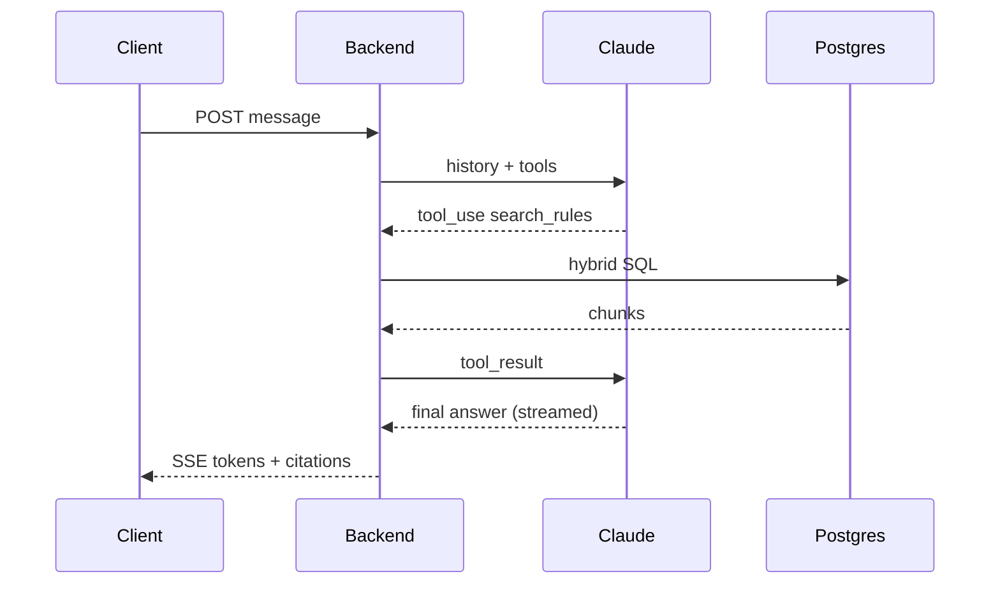

# TTRPG Sourcebook RAG – Tech Spec

## Overview

A chat assistant that answers questions about *Spire: The City Must Fall* from its sourcebooks, with book and page citations. It covers two kinds of question: mechanical rules, and setting lore (places, factions, people). Spire's rules and terminology differ sharply from D&D, so answers must never borrow D&D mechanics or terms.

## Goals

- Answer rules questions accurately, following cross-references between rules.
- Answer lore questions that draw on information scattered across many books.
- Cite every claim with book, section and page.
- Say clearly when the sources do not answer the question, instead of filling gaps from general game knowledge.

## Non-goals

- Supporting more than one game system or setting in v1.
- Scenario books, and scenario chapters inside source books. These hold the setting's secrets; v1 excludes them at ingest, so it has no spoiler filtering and no GM/player access split (see Future work).
- Rules adjudication beyond what the text says (no house rules, no homebrew).
- Character builders, dice rollers or VTT integration.
- Public distribution of book content. The corpus is personal-use only, from owned copies.

## Users

GMs and players get the same access. Scenario sections are excluded at ingest, so no content is filtered by user. v1 runs locally for one user; once hosted, access is invite-only and invited users are expected to own the books.

## Corpus and assumptions

The corpus is *Spire: The City Must Fall* across many sourcebooks totalling more than 1,000 pages, published together as a single consistent line. v1 ingests the source books only. Scenario books are out of scope, and scenario chapters inside source books are excluded at ingest.

| Property | Assumption | Design consequence |
| --- | --- | --- |
| Size | 1,000+ pages, roughly 500k–800k tokens | Too large for one context window; retrieval required |
| Chunk count | Roughly 5k–15k chunks | Fits comfortably in Postgres with pgvector; no dedicated vector DB |
| Consistency | Books printed together, no retcons or errata chain | No canon precedence or versioning logic |
| Layout | Two-column pages, sidebars, boxed text, stat blocks, tables | Layout-aware parsing is the highest-risk stage |
| Overlap | Some rules and faction summaries repeated across books | Near-duplicate detection at ingest (light) |
| Rules spread | Core mechanics in one book, options and extensions in others | Rules chunks tagged by mechanic so base rules and extensions are retrieved together |
| Entities | Same NPCs, factions and places recur across books under several names | Cross-book entity resolution is a core component |
| Format | Text-based PDFs (not scans) | Confirmed; no OCR needed |
| Image captions | Image alt text and captions land mid-sentence in extracted text, often at a page break | Caption removal and paragraph re-joining in the parse stage |
| Embedded scenarios | Some source books contain scenario chapters | Scenario sections excluded right after parsing |
| Terminology | Unusual names (the Azurite is a merchant class); rules unlike D&D | A reviewed game glossary constrains tagging, extraction and answers |

## Architecture

One Python codebase covers offline ingestion and the online API, with Postgres as the only data store.



| Component | Responsibility |
| --- | --- |
| core package | DB access, embedding and rerank clients, hybrid retrieval, entity lookup |
| ingest CLI | Parse PDFs, chunk, extract entities, dedupe, summarise, embed, load Postgres |
| app (FastAPI) | HTTP API, invite-only auth, sessions, SSE streaming, agent loop |
| eval | Runs the gold question set and reports metrics |
| Postgres | Chunks, vectors, full-text index, entities, relationships, summaries, users, eval data |
| web | Browser chat UI served by the backend: streamed answers, clickable citations, entity browser |

### Why one language

- The hard ingestion tools (Docling, Marker) and local ML models are Python-only.
- Ingestion, the API and the eval harness share one retrieval implementation in core, so what is evaluated is exactly what is served.
- Throughput is not a constraint: each answer waits 1–10 s on the LLM, and async FastAPI comfortably serves an invite-only group.

### Shared code rules

- Migrations are managed with Alembic in one place.
- The embedding model name, version and dimension are recorded in an `embedding_config` table. The API and ingestion both refuse to run on a mismatch.

## Ingestion pipeline

Ingestion is an idempotent Python batch job, run per book, that writes every stage's output to Postgres. Each stage is re-runnable on its own so a parser fix does not force re-running the LLM passes.


1. **Build the game glossary.** Before any other LLM pass, extract every game term from the core rulebook's contents, index, and the chapters on classes, resistances, skills, domains, stress and fallout, ancestries and factions. Each term gets a type, a one-line definition and its aliases (for example, the Azurite is a merchant class). The output goes to `config/glossary.yaml` for hand review (a few hundred terms, 1–2 hours), then loads as seed entities. The glossary is the controlled vocabulary for every later pass, which keeps D&D terms out of the index.
2. **Parse and clean.** Docling turns each PDF into a structured tree of headings, paragraphs, tables and sidebars, with page numbers kept; Marker is the fallback. Image alt text and captions are the known hazard: they appear mid-sentence, often at a page break, splitting a paragraph in two. The cleaner drops elements the parser labels as picture or caption, strips remaining image and page-break markers with per-book patterns, re-joins sentences split across page and column breaks, and removes line-end hyphenation. Captions are kept as separate caption chunks linked to their section, because they often carry lore. Output is cached as JSON per book.
3. **Exclude scenarios.** Sections listed under `exclude` in the per-book config (by heading, or page range as a fallback) are dropped. A model pass also flags sections with scenario signals (read-aloud text, GM-addressed instructions, keyed encounters, "scenario" in the heading) as `suspected_scenario`; these are held back until confirmed or released in the ingest report. This runs before chunking, so excluded text never reaches the index, entities or summaries.
4. **Chunk.** Split on the heading hierarchy, not fixed token windows. Stat blocks, ability entries and tables are atomic and never split. Target 200–600 tokens per chunk; sections over the limit split at paragraph boundaries. Every chunk keeps a parent section id, and gets its breadcrumb (Book > Chapter > Section) prepended to the text that is embedded.
5. **Classify and tag.** A model pass labels each chunk with `content_type` (rule, lore, stat_block, table, sidebar, caption) and `mechanics[]` for rules chunks. Structured output restricts `mechanics[]` to glossary terms; unknown values are rejected and logged for review, never stored.
6. **Entity extraction.** A model pass returns structured JSON per chunk: entity mentions (name, type, surface form) and relationships (subject, predicate, object) with the chunk as evidence. The glossary is in the prompt, so mentions link to existing seed entities instead of creating new ones, and types come from the fixed list.
7. **Entity resolution.** Merge mentions across books into canonical entities. Candidate pairs come from name and embedding similarity; a model confirms each merge. The hand-edited `entity_overrides.yaml` forces or blocks merges and wins over the model.
8. **Dedupe.** MinHash over chunk text flags near-duplicates. Duplicates collapse into one canonical chunk that keeps every source location for citation.
9. **Summaries.** Generate an entity dossier for each entity above a mention threshold, and a summary tree: section → chapter → book. All summaries keep citations back to their source chunks.
10. **Embed and load.** Embed chunks, dossiers and summaries with the self-hosted model, then upsert into Postgres in one transaction per book.

Per-book config example:

```yaml
book: spire_core
exclude:
  - section: "<scenario chapter heading>"
  - pages: [212, 240]
clean:
  drop_patterns:
    - "<END OF PAGE>"
    - "IMAGE with text '.*?' <IMAGE_END>"
```

Each run writes an ingest report listing suspected scenarios awaiting a decision, re-joined paragraphs for spot checks, rejected tags, and new entity merges.

Tables also get a one-line generated description, which is embedded; the table itself is stored as markdown for the answer.

## Data model

One Postgres database holds text, vectors, the full-text index and the entity graph, so hybrid search and filters run in a single query.

| Table | Key columns | Notes |
| --- | --- | --- |
| books | id, title, short_code, book_type | One row per sourcebook. book_type is descriptive metadata (core, supplement); it does not mark scenario content, since scenarios live inside source books — that split is per-section, see sections.status |
| sections | id, book_id, parent_id, title, path, page_start, page_end, status | The heading tree; parent-document retrieval returns these. status is included, excluded or suspected_scenario (set by ingest step 3), so scenario exclusion happens per-section, not per-book |
| chunks | id, section_id, text, embed_text, content_type, mechanics[], page_start, page_end, canonical_id, tsv, embedding | tsv is a generated tsvector; embedding is vector(N) with an HNSW index |
| chunk_locations | chunk_id, book_id, page | All locations of a deduplicated chunk |
| section_refs | from_chunk_id, to_section_id, raw_text | Parsed cross-references such as "see p. 212" |
| entities | id, canonical_name, type, dossier, dossier_embedding | Types: npc, faction, location, item, deity, event, class, ancestry, ability, resistance, condition, game_term, other; glossary terms are seeded here |
| entity_aliases | entity_id, alias | Lower-cased; trigram index for fuzzy lookup |
| entity_mentions | entity_id, chunk_id, surface_form | Links entities to evidence |
| entity_relations | subject_id, predicate, object_id, chunk_id | Predicates from a fixed list (member_of, leads, located_in, allied_with, rival_of, …) |
| summaries | id, level, ref_id, text, embedding | Levels: section, chapter, book |
| embedding_config | model, version, dims | Single row; checked at start-up by the API and ingestion |
| conversations, messages | id, user_id, role, content, citations | Chat history |
| eval_questions, eval_runs | question, expected_answer, expected_pages, scores | Evaluation data |
| users, invites | id, email, password_hash, created_at; token_hash, created_by, expires_at, redeemed_by | Invite-only accounts; invites are single-use |

Indexes: HNSW on every embedding column, GIN on tsv, GIN on mechanics, pg_trgm on `entity_aliases.alias`, and B-tree on the foreign keys and content_type.

## Query path

Every retrieval uses hybrid search (full-text plus vector, fused by reciprocal rank) with filters, then a reranker, and returns parent sections with citations.

### Hybrid search

1. Expand the query with glossary aliases ("merchant class" also searches "Azurite"), then run a BM25-style full-text query on tsv and an HNSW vector query on embedding, top 50 each, with the same filters (content_type, mechanics, book_id).
2. Fuse with reciprocal rank fusion: `score = Σ 1 / (60 + rank)`.
3. Rerank the top 50 fused results with a cross-encoder, keep the top 8–10.
4. Expand each hit to its parent section when the section is under a token budget (about 1,500 tokens); otherwise return the chunk plus its neighbours.
5. Collapse duplicates by canonical_id and attach every location from chunk_locations.

### Rules questions

- Filter content_type to rule, table and stat_block.
- Pull all chunks tagged with the same mechanics values as the top hits, so extensions from other books come with the base rule.
- Follow section_refs from retrieved chunks one hop.

### Lore questions

- Resolve names in the question against entity_aliases (exact, then trigram).
- Return the entity dossier and its one-hop relationships first, then hybrid search restricted to chunks that mention the entity.
- Broad questions ("overview of the northern kingdoms") go to the summary tree first, then drill down.

### Generation rules

- Answer only from retrieved text, in Spire's own terms. Never substitute D&D mechanics or terminology. If it is not there, say so and say what was searched.
- Cite each claim as `[Book short code p. N]`; the API maps citations back to chunk ids for the client.
- Summarise in the answer's own words. Quote exact wording only where precision matters (numbers, conditions, triggers), capped at about two sentences per answer.

## Agent loop and tools

The backend runs Claude in a tool-use loop, so the model chooses which of the retrieval paths above to run and can follow multi-hop questions. The loop caps at 6 tool rounds and a per-request token budget, then answers with what it has.



| Tool | Input | Returns |
| --- | --- | --- |
| search_rules | query, mechanics?, book? | Reranked rule, table and stat-block sections with citations |
| search_lore | query, entity?, book? | Reranked lore sections with citations |
| lookup_entity | name | Dossier, aliases, one-hop relationships, top mention locations |
| related_entities | entity, predicate? | Entities linked by a relationship (for example members of a faction) |
| get_section | section id or book + page | Full section text; used to follow cross-references |
| get_overview | topic or book or chapter | Summary-tree node with child summaries |

Tool results carry chunk ids so citations in the final answer can be checked against what was actually retrieved; citations that do not match are stripped and logged.

## Public API

The backend exposes a small JSON API and streams answers over Server-Sent Events.

| Method | Path | Purpose |
| --- | --- | --- |
| POST | /v1/conversations | Start a conversation |
| GET | /v1/conversations/{id} | Conversation with messages and citations |
| POST | /v1/conversations/{id}/messages | Send a question; responds with an SSE stream |
| GET | /v1/sources/{chunk_id} | Citation metadata (book, section, page); no book text |
| GET | /v1/entities?q= | Entity search for autocomplete and browsing |
| GET | /v1/entities/{id} | Entity dossier and relationships |
| GET | /healthz | Liveness, DB connectivity, embedding config check |
| POST | /v1/invites/{token}/accept | Redeem an invite and create an account |
| POST | /v1/auth/login | Start a session (HTTP-only cookie) |

SSE event types: status (tool being run, for a "searching rules…" indicator), token (answer text), citation (chunk id, book, page), done (usage and message id), error.

Implementation notes: FastAPI with async endpoints, psycopg 3 async pool with the pgvector adapter, the official Anthropic Python SDK, sse-starlette for streaming, Pydantic models for request and tool schemas, structlog for structured logs. CPU-bound work (a self-hosted reranker) runs in a worker thread so it never blocks the event loop.

## Embedding and reranking

Embedding and reranking run inside the Python backend, using self-hosted models loaded in-process; there is no separate model service. The host machine has enough RAM and CPU for this.

- **Shared code:** `core.models` loads the configured embedder and reranker, and ingestion, the API and eval all use it, so query and index embeddings cannot drift.
- **Start-up check:** the loaded model's name, version and dims are compared to `embedding_config`.
- **Latency target:** under 50 ms for one query embedding, under 300 ms to rerank 50 candidates.

| Option | Pros | Cons |
| --- | --- | --- |
| Hosted embedding and rerank APIs | Light backend; nothing extra to operate | Per-call cost; external dependency |
| Self-hosted, in-process (chosen) | No per-call cost; full control of models | Backend needs more RAM and CPU; slower start-up |

## Evaluation

A hand-written gold set of 80–100 questions gates every change to parsing, chunking, retrieval or prompts. It is built before the retrieval code is tuned.

| Category | Share | Example shape |
| --- | --- | --- |
| Single rule lookup | 20% | What triggers condition X? |
| Multi-hop rule | 20% | How does ability A interact with condition B? |
| Table or stat block | 10% | What is creature Y's defence value? |
| Entity fact | 15% | Who leads faction F? |
| Cross-book entity | 15% | Everything known about NPC N |
| Broad overview | 5% | Main political tensions in region R |
| Not answerable | 5% | Something the books never cover |
| Terminology trap | 5% | D&D-style phrasing, such as the rogue equivalent; answer must use Spire's terms |
| Excluded scenario | 5% | Answerable only from an excluded scenario; must be declined |

Each question records the expected answer and the expected pages.

| Metric | Measures | v1 target |
| --- | --- | --- |
| Retrieval recall@10 | Expected pages present in retrieved results | ≥ 90% |
| Answer correctness | LLM-graded against the expected answer, spot-checked by hand | ≥ 85% |
| Citation precision | Cited pages that actually support the claim | ≥ 95% |
| Abstention | Unanswerable questions correctly declined | 100% |
| Latency | Time to first token, p50 | ≤ 3 s |
| D&D leakage | Answers using D&D terms or mechanics | 0 |
| Scenario leakage | Excluded scenario content in answers | 0 |

Retrieval and answer metrics are reported separately, so a failure can be traced to parsing, retrieval or generation.

## Operations, security and cost

The whole system runs as Docker Compose on one machine: Postgres and the FastAPI backend. Ingestion runs as a one-off container. v1 runs locally only.

- **Repo layout:** one Python project with core/, ingest/, app/, eval/, migrations/ (Alembic), config/, and books/ (git-ignored; PDFs never committed).
- **Config:** environment variables for secrets (API keys, DB URL, session secret); YAML for pipeline settings and per-book overrides.
- **Access:** v1 is local only and binds to localhost. Once hosted, access is invite-only, with no public sign-up. An admin CLI command issues single-use invite links that expire after 7 days. Every endpoint except /healthz needs a session. Invited users are expected to own the books and check citations in their own copies.
- **Content exposure:** the API never returns book text directly. Answers summarise rather than reproduce, quotes are capped at about two sentences, and each user is rate-limited (default 100 questions a day) to stop bulk extraction.
- **Observability:** structured logs with a request id through every tool call; each answer logs retrieved chunk ids, tool calls, token usage and latency, for debugging bad answers.
- **Security:** the API sits behind a reverse proxy with TLS. Passwords are hashed with argon2; sessions use secure HTTP-only cookies.
- **Cost:** ingestion LLM passes (classification, extraction, summaries) run once per book and are the largest one-off spend. Per-question cost is dominated by the agent loop's input tokens; prompt caching of the system prompt and tool definitions reduces it. Track cost per question in the eval runs.
- **Backups:** nightly pg_dump. Parsed JSON per book is kept so the database can be rebuilt without re-parsing.

## Milestones

Build depth on two or three books before scaling to the full library; each milestone ends with an eval run.

| # | Milestone | Done when |
| --- | --- | --- |
| M0 | Schema and contract | Migrations applied; embedding_config checked at start-up |
| M1 | Glossary, parse and chunk 2–3 books | Core rules and main setting book parsed; glossary reviewed; captions stripped and split paragraphs re-joined; scenario exclusions confirmed; chunks reviewed by hand |
| M2 | Hybrid search CLI | A CLI prints top chunks with book and page; gold set written; recall@10 measured |
| M3 | Answering with citations | Single-shot RAG answer through the FastAPI backend over SSE; correctness and citation metrics measured |
| M4 | Entity layer | Extraction, resolution, overrides file, lookup_entity tool; entity questions measured |
| M5 | Agent loop | All six tools live; multi-hop and cross-book questions meet targets |
| M6 | Summaries and dedupe | Summary tree and dossiers built; duplicates collapsed with every citation kept |
| M7 | Full library | All books ingested; full eval passes at v1 targets |
| M8 | Client | Web UI on top of the API, running locally |

The milestones are broken into tickets with acceptance criteria and test steps in Tickets.

## Open questions

Decided on 24 Sep 2026:

| Question | Decision |
| --- | --- |
| Setting and system | Spire: The City Must Fall; rules very different from D&D |
| PDF format | Text-based, no OCR; image captions interleave with body text and are cleaned in the parse stage |
| Embeddings and reranker | Self-hosted, in-process; the host has enough RAM and CPU |
| Client | Web UI |
| Hosting | Local only to begin; invite-only hosting later |

Still open:

- [ ] Which embedding model and dimension?
- [ ] Which reranker model?
- [ ] Which source books contain scenario chapters, and where?

## Future work

- **Scenario books and spoiler control.** Scenario content lives in sections, not whole books, so `sections.status` is the seam. v1 marks excluded scenario sections `excluded` and drops them at ingest; later work ingests them instead and lets `status` drive a `gm_only` flag that propagates section → chunk → entity, a GM or player access level per session taken from the auth token, and filtering applied in SQL rather than the prompt. Because the classification is per-section from the start, this needs no schema redesign.
